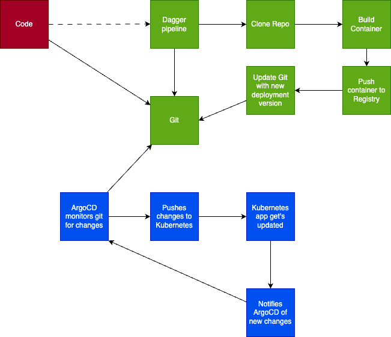

For this workshop, we are using [Tekton](https://tekton.dev) as our CI tool.

There are many options out there, each with their own pro's and cons.

Tekton is an extensible CI (and CD) tool, that you install on a Kubernetes cluster, and deploy tasks and pipelines from. 

We will be using it to pull from your Git Repository, build a container image, and then push this container image, to your registry, and update your deployment manifest.

The green boxes show in the picture.

Note we have chosen to split up CI and CD, so that Tekton handles CI and ArgoCD handles CD. 

***
**Talk in class about**

- Benefits of splitting CI/CD up
- Benefits of keeping them togher
- Different tools (Jenkins, Argo, Tekton, Github Actions, Gitlab etc.)
***