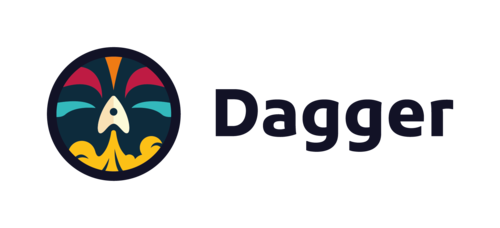

For this workshop, we are using [Dagger](https://dagger.io) as our CI tool.

There are many options out there, each with their own pro's and cons.

Dagger works by creating pipelines as code, and running it in containers. 

It's big strength is that you can run and test it local and remote, and get the same results. 

This is usefull in our enviroment, where we have some restrictions, compared to a "real" enviroment.

We will be using it to pull from your Git Repository, build a container image, and then push this container image, to your registry, and update your deployment manifest.

The green boxes show in the picture.

Note we have chosen to split up CI and CD, so that Dagger handles CI and ArgoCD handles CD. 

***
**Talk in class about**

- Benefits of splitting CI/CD up
- Benefits of keeping them togher
- Different tools (Dagger, Jenkins, Argo, Tekton, Github Actions, Gitlab etc.)
***