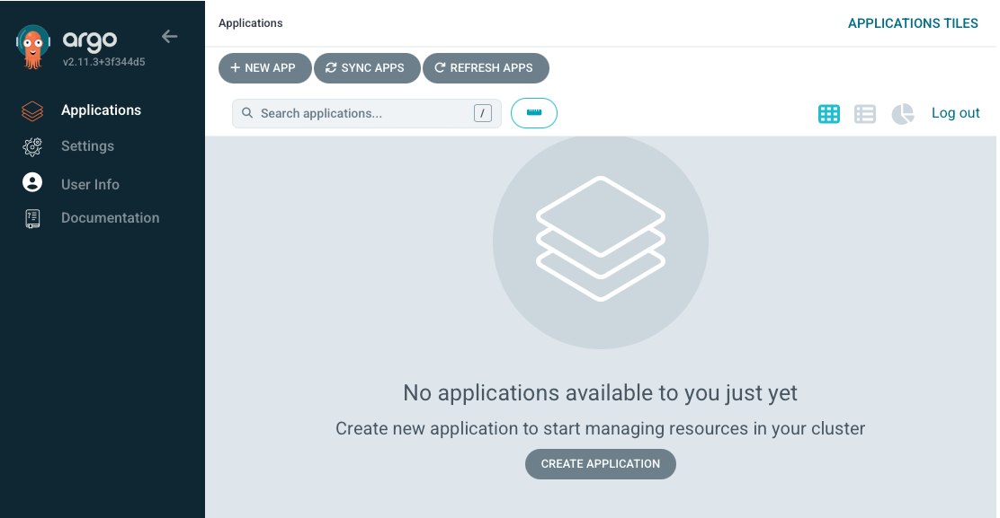

For CD (Continus Deployment) we will be using [ArgoCD](https://argoproj.github.io/cd/).

ArgoCD is one of the major solutions for doing CD.

It's often compared with [Flux](https://fluxcd.io) and both products have a lot of overlapping features.

One of the major reasons for using Argo in this workshop, over Flux, is that ArgoCD has a nice UI, where we can see the changes that we are doing.

ArgoCD is already installed, but to access it, we first need to get a password.

The password is generated on deployment.

Run the following to get yours.

```terminal:execute
prefix: Run
title: Get ArgoCD password from secret
command: |
    ARGOCD_PASSWORD=$(kubectl -n argocd get secret argocd-initial-admin-secret -o jsonpath="{.data.password}" | base64 -d)
    echo $ARGOCD_PASSWORD
```

Copy it to the clipboard, and open the ArgoCD tab

```dashboard:reload-dashboard
prefix: Open
title: Open ArgoCD
name: ArgoCD
url: ://argocd-.
```

Login with username `admin` and the password you just copied.

You should now see an UI, that looks like this


All settings in the UI, can be done, using CLI or Yaml.

We will only be using the UI for view and refresh of applications.

All other settings, will be added using yaml files.

More on that in the next step.
