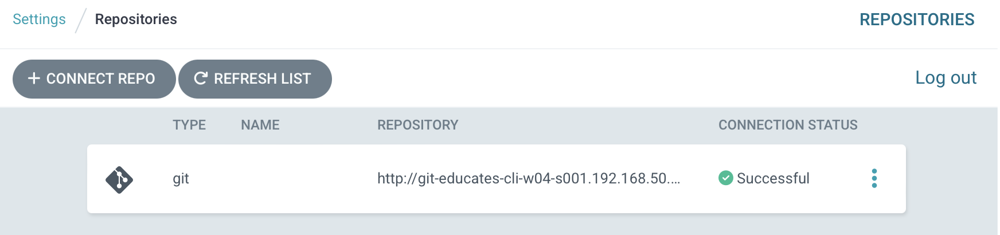
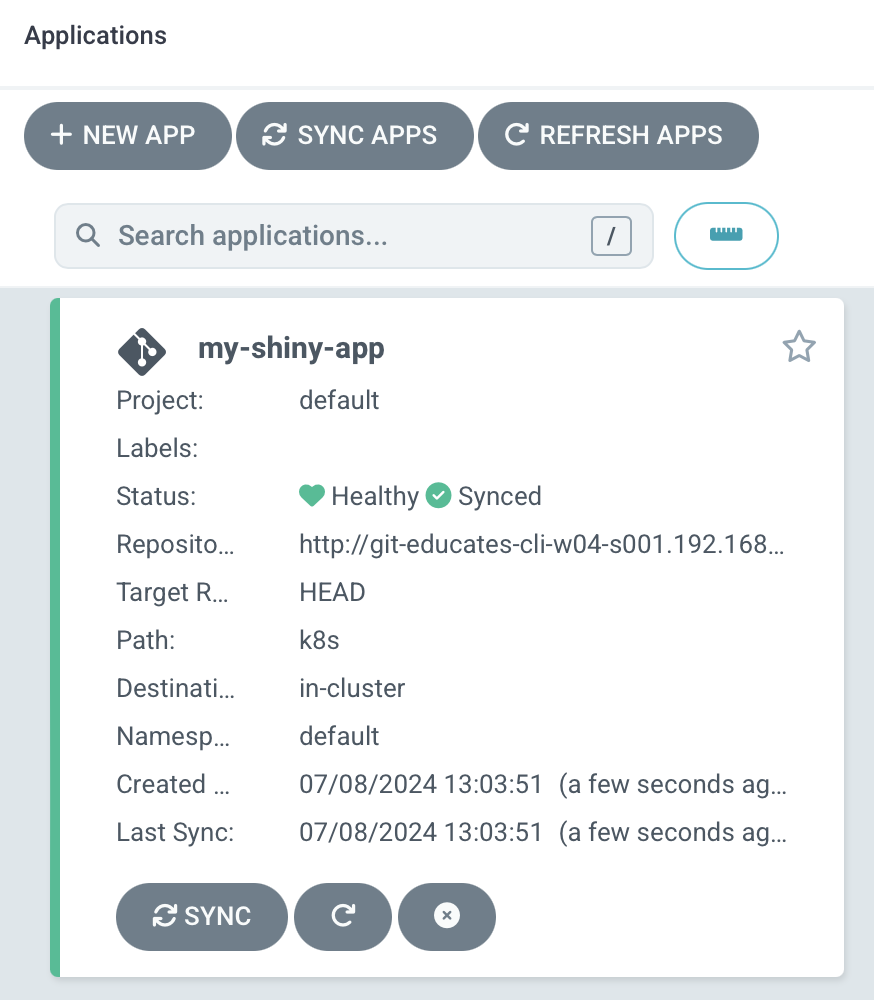
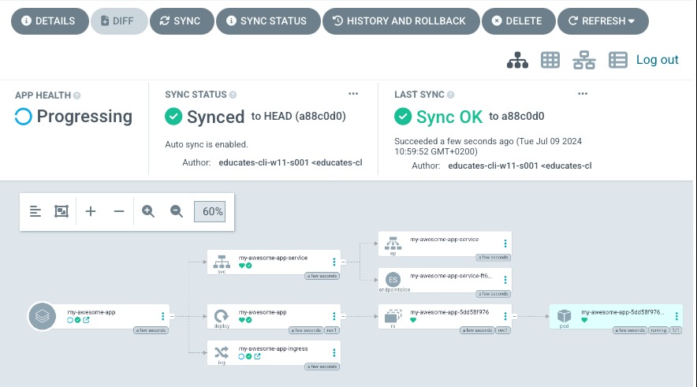

Now that we got ArgoCD working, let's setup the CD, so we can start to deploy our app.

The first thing we need to do, is to give ArgoCD access to our git repository.

It can be done usig UI, CLI or yaml. 

We will chose the last one.

Take a look at the argocd-repo.yaml file you have in your exercise folder.

```editor:open-file
title: Open argocd-repo.yaml
file: ~/exercises/argocd-repo.yaml
```
It should look something like this

```yaml
apiVersion: v1
kind: Secret
metadata:
  name: my-repo
  namespace: argocd
  labels:
    argocd.argoproj.io/secret-type: repository
stringData:
  type: git
  url: http://git-educates-cli-w05-s003.192.168.50.243.nip.io/myapp.git
  password: IXcklS71Ag85ULYDhPFt6zpMwvnqWema
  username: educates-cli-w05-s003
```

All it does, is to tell ArgoCD that if it want's to connect to the url under Stringdata (our git repo), then it need to use the suplied username and password.

Quite simple

This can also be done, for other types of repositories, where you need SSH keys etc. to access them.

Let's apply the yaml file
```terminal:execute
command: |
  kubectl apply -f ~/exercises/argocd-repo.yaml
```

We can verify it, by opening th ArgoCD UI, selecting settings -> Repositories and seeing our git repo has been added and is saying "successful"



Now that we can access the Git repository, we will add the app configuration.

Start by opening the app configuration.

```editor:open-file
title: Open argocd-app.yaml
file: ~/exercises/argocd-app.yaml
```

The file looks something like this
```yaml
apiVersion: argoproj.io/v1alpha1
kind: Application
metadata:
  name: my-awesome-app
  namespace: argocd
spec:
  project: default
  source:
    repoURL: http://git-educates-cli-w04-s001.192.168.50.243.nip.io/myapp.git
    targetRevision: HEAD
    path: k8s
  destination:
    server: https://kubernetes.default.svc
    namespace: default
  syncPolicy:
    automated:
      prune: true
      selfHeal: true
```
It contains, all the info that ArgoCD need, to know, to be able to deploy the app.

This means :
- Git Repo
- Path in that repo, for the config files (ours is in the k8s folder, in the app folder)
- Namespace to deploy to
- Destination server (ArgoCD can handle multiple Kubernetes servers if needed)
- And how to deploy it (shoud it clean up, auto heal etc.)

Let's apply it as well.

```terminal:execute
command: |
  kubectl apply -f ~/exercises/argocd-app.yaml
```

Open the ArgoCD UI, and see a new app has been created.


If you click on it, then you will see an overview, of all the componments it contains (deployment, service, ingress).


Depending on your screen resolution, it might be a bit small.

Use the zoom buttons, to make it fit.

ArgoCD now manages our application, and checks every 3 minutes, for changes in Git, and if there is any, it will update the application accordingly.

To see your app, open the "my-awesome-app" tab:
```dashboard:reload-dashboard
prefix: Open
title: my-awesome-app
name: my-awesome-app
url: ://my-awesome-app-.
```