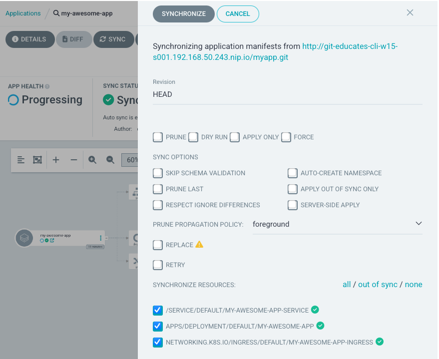

Now that we have a working application, let's try to change it a bit, and see the deployment work.

Start by opening index.html your editor.
```editor:open-file
title: Open index.html
file: ~/exercises/app/html/index.html
```

On line 18, you should find the following line
```
<div class="container"><a class="navbar-brand px-0 py-0" href="#">Awesome CICD App</a>
```

Replace awesome with your name, so it says 
```
<div class="container"><a class="navbar-brand px-0 py-0" href="#">Robert's CICD App</a>
```
Save the file, and open the source control icon, that should now have a 1 on it.


Click the `+` nex to index.html, and give it a proper commit mesage, and click commit.


Click `Sync Changes` to push the changes, to our remote git repo.

If you get a warning, just click ok.

Now let's run our CI pipeline again.

```execute-2
  cd ~/exercises/app
  make deploy
```

To deploy it, ArgoCD needs to see that there is a change in the remote Git repository, in the k8s folder.

It checks every 3 minute, but we can also force a sync.

Open the app in ArgoCD, and click sync.


click Sync and the Syncronize, on the top Button, in the sidebar that apears.


You should now see, that it detects a new container, and deploys it, by swapping it out, with the old one (the blue boxes in the end)


Refresh the app window, by clicking here and see your changes
```dashboard:reload-dashboard
prefix: Open
title: my-awesome-app
name: my-awesome-app
url: ://my-awesome-app-.
```

For me that looks like this


We have now updated our app automatic (almost) just by changing our code.

But what if we wanted to change the scaling of the app ?

Let's explore that in the next module.