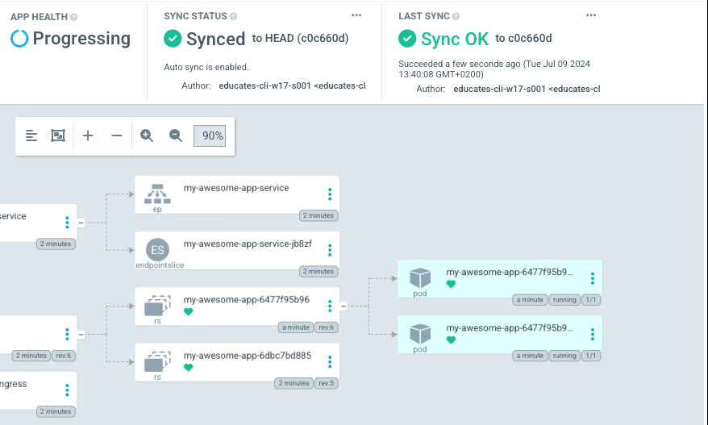

In our K8S folder, under App, we have 3 files.

``` 
[~/exercises/app/k8s] $ tree
.
├── deployment.yaml
├── ingress.yaml
└── service.yaml
```

These 3 files, contain the deployment info, that Kubernetes need, and it's what ArgoCD looks at, for changes.

Just as we can update our application, and deploy it automatic. We can also update our deployment, and let ArgoCD handle it.

Let's say we want to have 2 pods running, wíth our application, for failover instead of just one.

All we need to do, is to open deployment.yaml in our editor
```editor:open-file
title: Open index.html
file: ~/exercises/app/k8s/deployment.yaml
```

And change replicatas from 1 to 2.
Then save it, and push it to our git repo.

Try that, and then log into ArgoCD and see what happens.


The result should be, that you now have 2 pods running, and argo has taken care of it all for you.

You should also see that the app, works just like before, and that the new "Failover" is transparent to the end users.

```dashboard:reload-dashboard
prefix: Open
title: my-awesome-app
name: my-awesome-app
url: ://my-awesome-app-.
```
